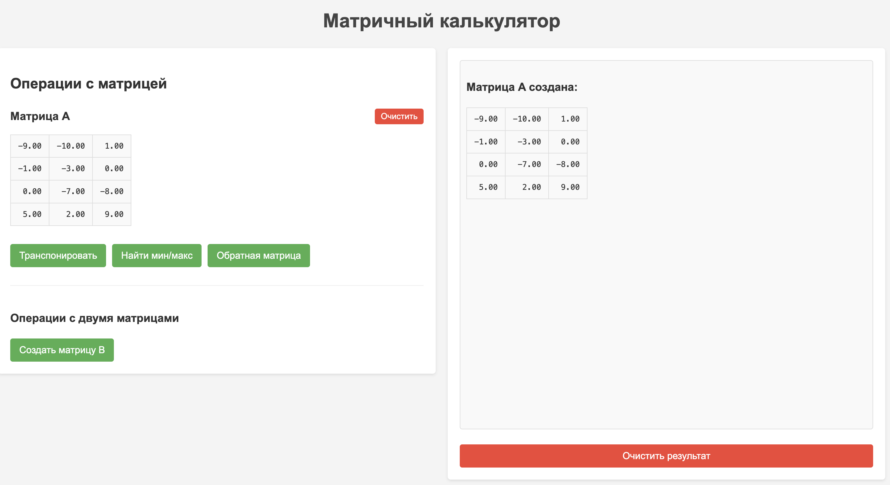
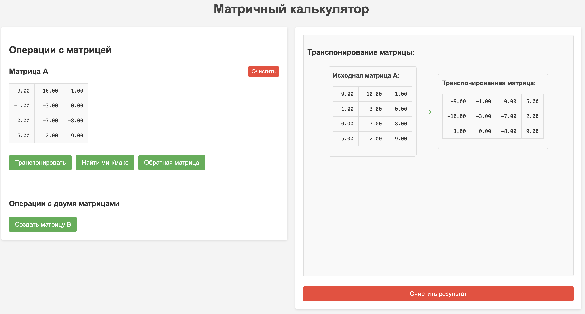
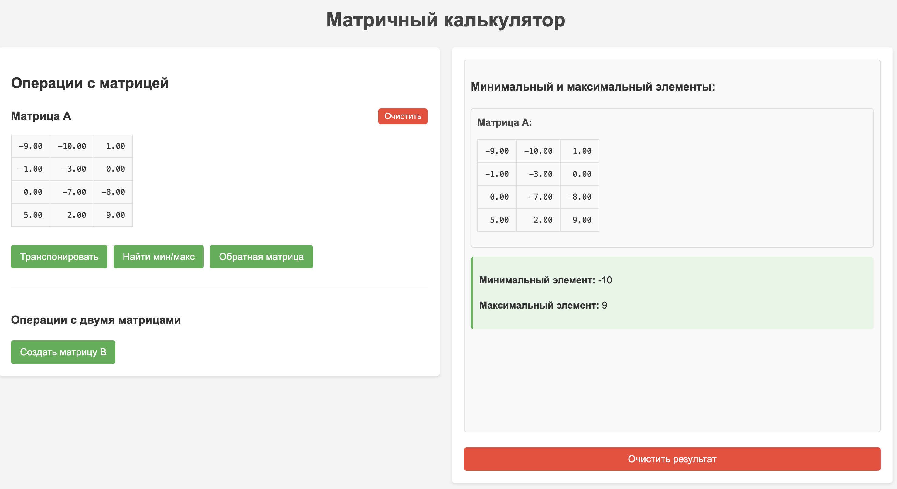
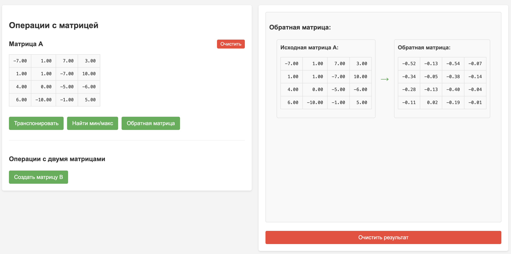
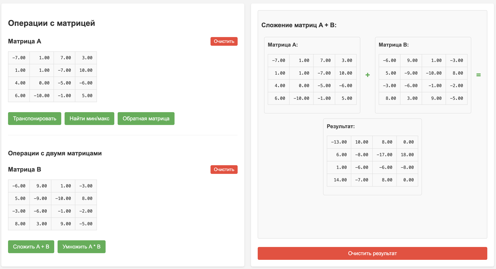
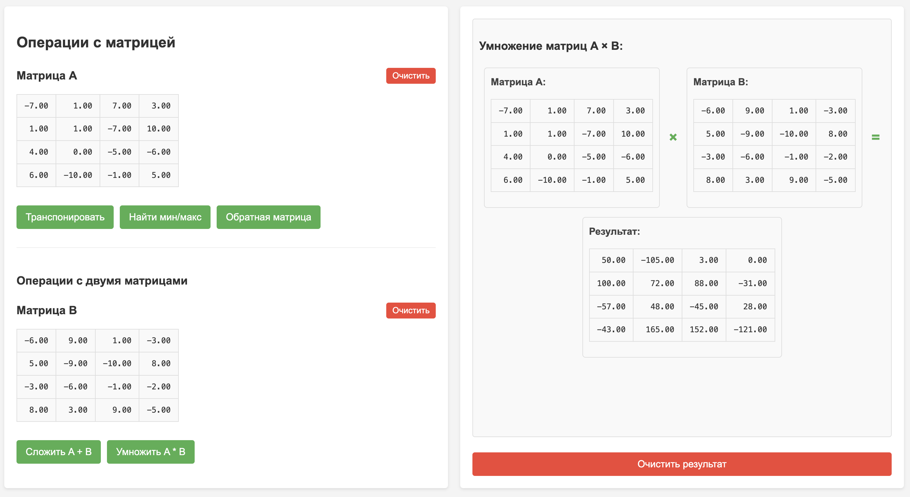
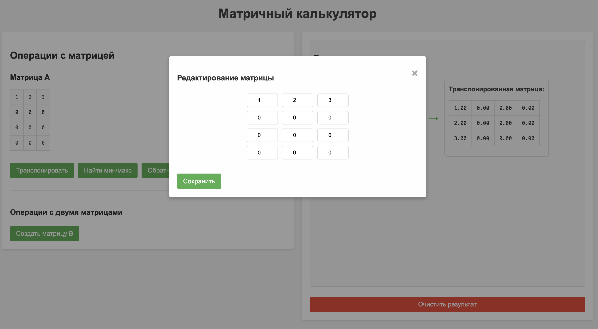

# Матричный калькулятор на Perl

## Описание проекта

Данный проект представляет собой веб-приложение для работы с матрицами, реализованное на языке Perl с использованием CGI и веб-интерфейса. Приложение позволяет создавать матрицы и выполнять различные операции над ними.

## Функциональные возможности

Класс `Matrix` реализует следующие операции над матрицами:
- Создание матрицы заданных размеров
- Вывод матрицы на экран в понятном формате
- Транспонирование матрицы
- Определение максимального и минимального элементов матрицы
- Сложение с другой матрицей
- Умножение на другую матрицу
- Вычисление обратной матрицы

## Структура проекта

```
/matrix/
├── cgi-bin/
│   ├── Matrix.pm       # Модуль с классом Matrix
│   └── matrix.pl       # CGI-скрипт для обработки запросов
├── public_html/
│   ├── index.html      # HTML-страница интерфейса
│   ├── style.css       # Стили для интерфейса
│   └── script.js       # JavaScript для клиентской логики
├── Dockerfile          # Файл для сборки Docker-контейнера
├── httpd.conf          # Конфигурация Apache
├── start.sh            # Скрипт для запуска сервиса
└── README.md           # Документация проекта
```

## Архитектура приложения

Приложение построено по клиент-серверной архитектуре:

### Серверная часть
- **Matrix.pm**: Perl-модуль, реализующий класс для работы с матрицами
- **matrix.pl**: CGI-скрипт, обрабатывающий запросы от клиента и использующий класс Matrix

### Клиентская часть
- **index.html**: Структура веб-интерфейса
- **style.css**: Стили для оформления интерфейса
- **script.js**: JavaScript-код для взаимодействия с пользователем и отправки запросов на сервер

### Взаимодействие клиент-сервер

1. Пользователь взаимодействует с веб-интерфейсом (создает матрицы, выбирает операции)
2. JavaScript формирует запрос к серверу с необходимыми параметрами
3. CGI-скрипт на сервере обрабатывает запрос, используя класс Matrix
4. Результат операции возвращается клиенту в формате JSON
5. JavaScript обрабатывает полученные данные и отображает результат в интерфейсе

## Реализация класса Matrix

Класс Matrix реализован в виде Perl-модуля и предоставляет следующие методы:

- `new($rows, $cols, $data)` - конструктор для создания новой матрицы
- `fill_random($min, $max)` - заполнение матрицы случайными числами
- `get($row, $col)` - получение элемента матрицы
- `set($row, $col, $value)` - установка значения элемента матрицы
- `to_html()` - преобразование матрицы в HTML-представление
- `transpose()` - транспонирование матрицы
- `find_min_max()` - поиск минимального и максимального элементов
- `add($matrix)` - сложение с другой матрицей
- `multiply($matrix)` - умножение на другую матрицу
- `determinant()` - вычисление определителя матрицы
- `inverse()` - вычисление обратной матрицы

## Запуск приложения

1. Убедитесь, что у вас установлен Docker
2. Клонируйте репозиторий
3. Сделайте скрипт запуска исполняемым: `chmod +x start.sh`
4. Запустите сервис: `./start.sh`
5. Откройте в браузере: http://localhost:8083

## Примеры использования

### Создание матрицы



### Транспонирование матрицы



### Поиск минимального и максимального элементов



### Вычисление обратной матрицы



### Сложение матриц



### Умножение матриц



### Редактирование матрицы



## Технические особенности

- Приложение запускается в Docker-контейнере, что обеспечивает изоляцию и простоту развертывания
- Веб-сервер Apache используется для обработки HTTP-запросов и запуска CGI-скриптов
- Интерфейс адаптивен и корректно отображается на устройствах с разными размерами экрана
- Реализована проверка корректности ввода и обработка ошибок

## Ограничения

- Максимальный размер матрицы ограничен 10×10 для предотвращения перегрузки сервера
- Для вычисления обратной матрицы требуется, чтобы матрица была квадратной и имела ненулевой определитель 